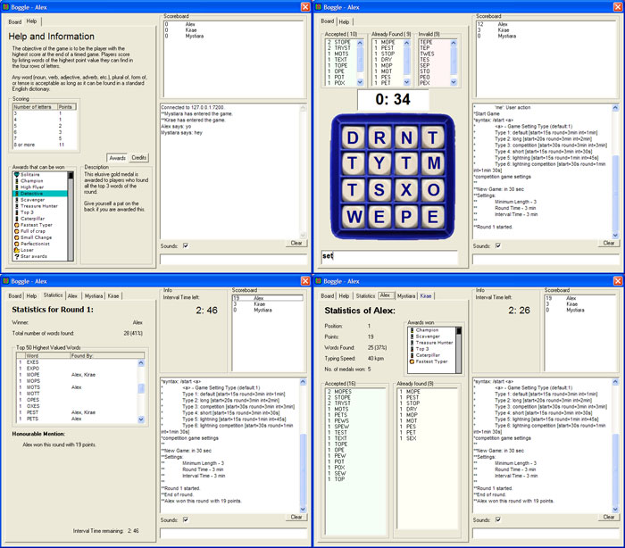



## Multiplayer Boggle

### Description

Multiplayer Boggle ==&gt;

An attempt to create a multiplayer version of the popular game Boggle to play with my friends online.

----

Features include:

-Ability to customize almost every aspect of the round (eg Time of each round, interval timing, minimum word length, etc.)

-A plethora of awards (eg Champion medal, Caterpillar word award, Treasure hunter award, Detective award, etc.) to be awarded to outstanding players every round!

-Custom coded Depth First Search to find if word entered exists in board

-Top 50 words of each round displayed after each round

-In-game Dictionary to display dictionary entry of any of the top 50 words. Just click on the word in the listbox and an explanation will pop up.

-Interesting End-round statistics shown (eg % of total words found, typing speed, words found by each player, etc.)

-Dynamic in-game chat

-A short help tab to explain to beginners how to play this game by Hasbro, as well as to display the awards that could be won

-Gigantic internationally recognized lexicon of words (Enable2k) for nearly every valid word in the dictionary to be recognized by the game.

-Up to 1000 players supported! (If you can find that many)

Useful for programmers attempting to learn tcp network code.

Coded in 3 days in VB 6.0.

Please leave constructive comments and report any bugs encountered. Suggestions are also very welcome.

Thanks!

***P.S. Read the readme.txt file before compiling!
 
### More Info
 

             |
---                |---
**Submitted On**   |2005-10-01 19:09:18
**By**             |[Alexander Chia](https://github.com/Planet-Source-Code/PSCIndex/blob/master/ByAuthor/alexander-chia.md)
**Level**          |Intermediate
**User Rating**    |4.8 (24 globes from 5 users)
**Compatibility**  |VB 6\.0
**Category**       |[Games](https://github.com/Planet-Source-Code/PSCIndex/blob/master/ByCategory/games__1-38.md)
**World**          |[Visual Basic](https://github.com/Planet-Source-Code/PSCIndex/blob/master/ByWorld/visual-basic.md)
**Archive File**   |[Multiplaye1936731022005\.zip](https://github.com/Planet-Source-Code/alexander-chia-multiplayer-boggle__1-62729/archive/master.zip)

